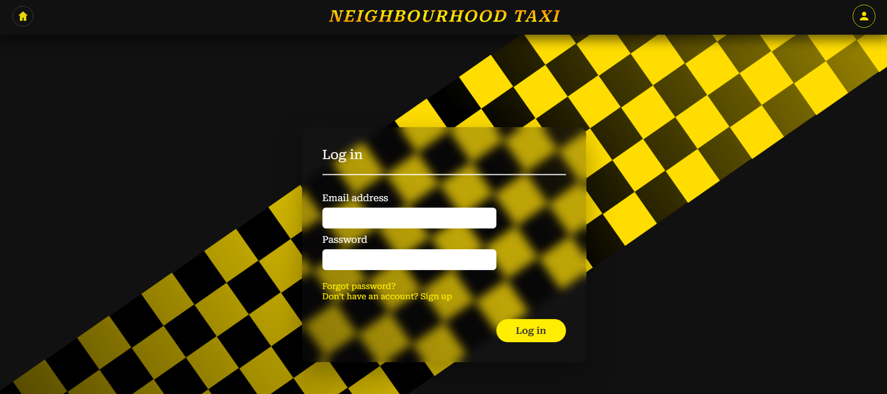
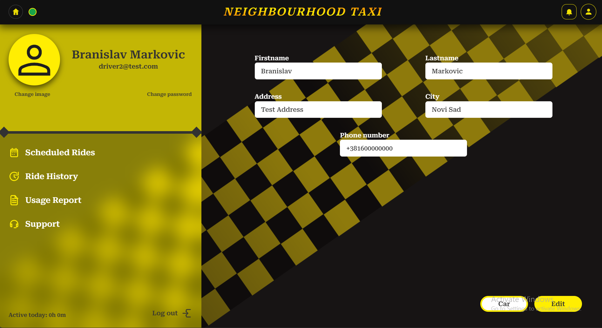
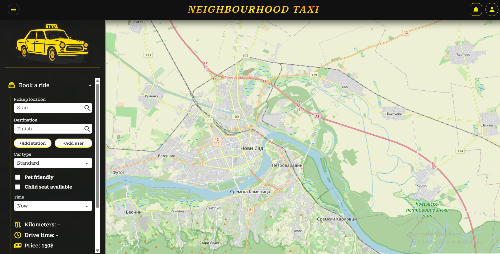
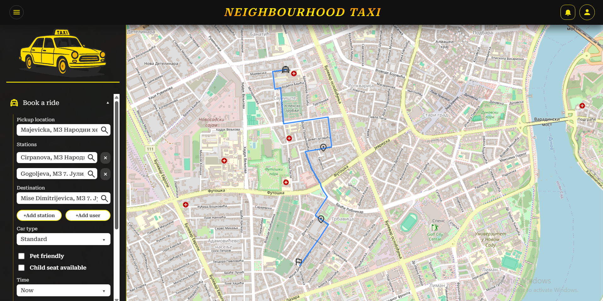
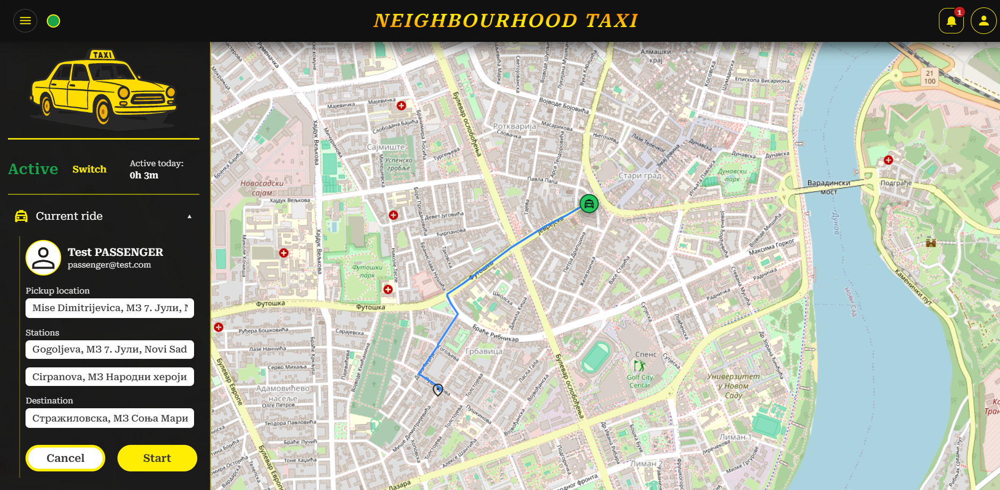
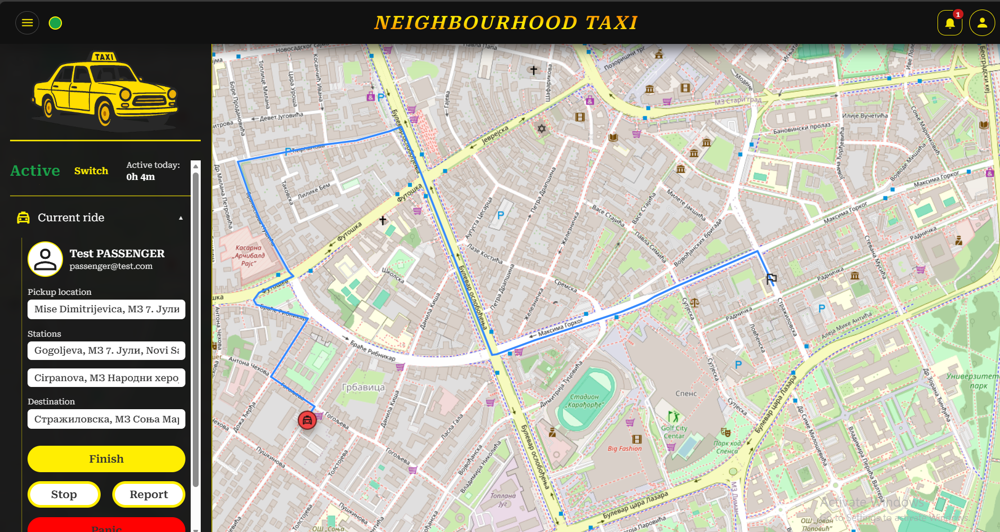
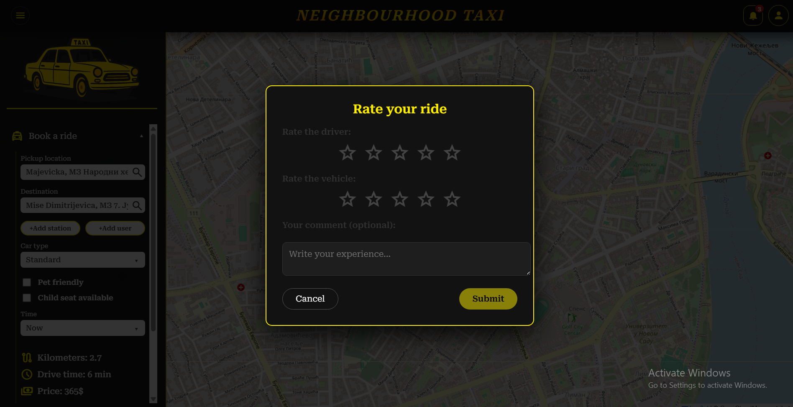
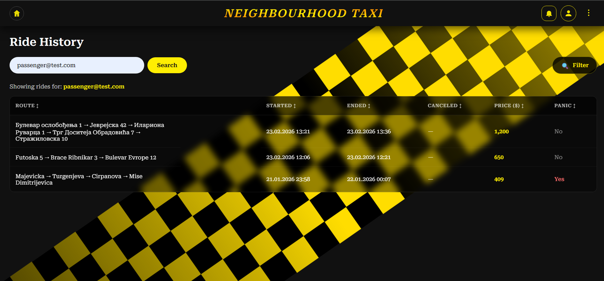
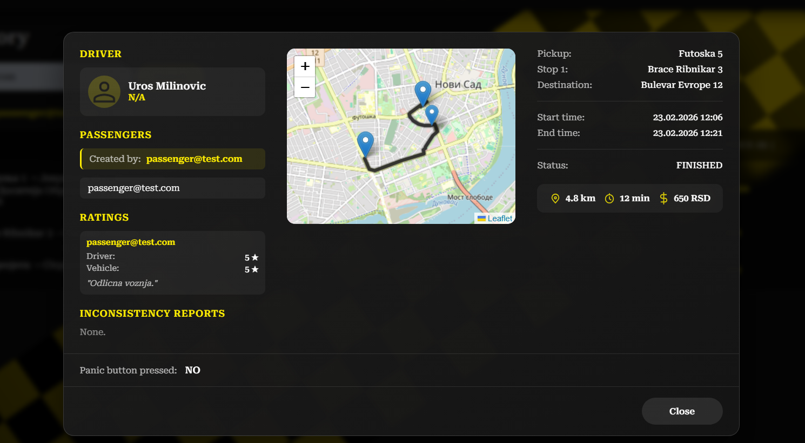
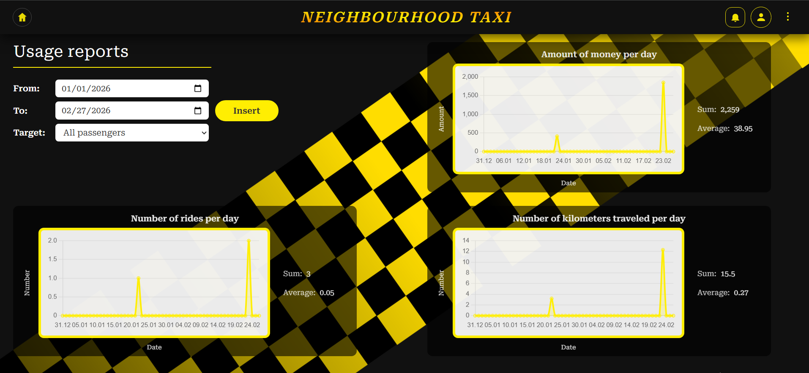

# Neighbourhood Taxi - Complete Ride-Hailing Ecosystem

Neighbourhood Taxi is a robust, enterprise-grade taxi service solution featuring a centralized **Spring Boot** backend, an interactive **Angular** web dashboard, and a feature-rich **Android** mobile application. The system provides a seamless experience for passengers, drivers, and administrators, utilizing real-time communication to bridge the gap between service demand and supply.

---

## Authors

- [**Branislav Marković**](https://github.com/bane-31)
- [**Nikola Savić**](https://github.com/nikolasa004)
- [**Uroš Milinović**](https://github.com/UrosMilinovic)

---

## Demo

Login page

---
Profile

---
Ordering ride

---

---
Ride flow & ride rating

---

---

---
Ride history

---

---
Live chat support

---

---
Usage report

---

## Table of Contents

- [Prerequisites, Installation, and Running](#prerequisites-installation-and-running)
- [Description of the Problem and Solution](#description-of-the-problem-and-solution)
- [Used Technologies](#used-technologies)
- [Project Structure](#project-structure-monolith)
- [Implemented Features](#implemented-features)
- [Feature Status](#feature-status)

---

## Prerequisites, Installation, and Running

### 0. Clone the Repository

Start by cloning the project from GitHub:

```bash
git clone https://github.com/kzi-nastava/mrs-team9-Komsiluk.git
cd mrs-team9-Komsiluk
```

### 1. Backend (Spring Boot)
* **Prerequisites:** Java JDK 17, Maven, PostgreSQL.
* **Setup:**
    ```bash
    cd backend
    # Configure src/main/resources/application.properties with your DB credentials
    mvn clean install
    mvn spring-boot:run
    ```

### 2. Frontend (Angular)
* **Prerequisites:** Node.js (v18+), Angular CLI.
* **Setup:**
    ```bash
    cd src
    npm install   # required — node_modules/ is listed in .gitignore and not included in the repository
    ng serve
    ```
* Access at `http://localhost:4200`.

### 3. Mobile (Android)
* **Prerequisites:** Android Studio, API Level 24+.
* **Setup:**
    1. Open the `taxi` folder in Android Studio.
    2. Sync the project with Gradle files.
    3. Update the `BASE_URL` in the network configuration to point to your backend IP.
    4. Run on an emulator or physical device.

---

## Description of the Problem and Solution

**The Problem:** Traditional taxi services often suffer from inefficient dispatching, lack of price transparency, and poor synchronization between different platforms. Existing solutions rarely provide a unified experience across Web, Mobile, and Backend with enterprise-level security and real-time safety features.

**The Solution:** Komsiluk Taxi implements a **Unified Messaging Architecture**. By combining **STOMP over WebSockets** for live updates and **Firebase Cloud Messaging (FCM)** for background mobile alerts, the system ensures zero-latency communication. It enforces strict data integrity via an **Admin Review Workflow** and prioritizes user safety through a high-priority **Panic System**.

---

## Used Technologies

### Backend (Core Engine)
- **Spring Boot & Java:** The backbone of the system for RESTful API and business logic.
- **Spring Security & JWT:** Implements **Stateless Authentication** and **Role-Based Access Control (RBAC)**.
- **Spring Data JPA (DAO Pattern):** Utilized for efficient database abstraction and repository-based data access.
- **WebSockets (STOMP):** Real-time bidirectional communication for ride status and GPS tracking.

### Web Frontend (Admin & Passenger Portal)
- **Angular & TypeScript:** Provides a reactive UI with modular component-based architecture.
- **RxJS:** Manages asynchronous data streams, essential for handling live map updates.
- **Leaflet:** Integration for interactive maps and route rendering.
- **HTTP Interceptors:** Centralized logic for attaching JWT tokens to all outgoing requests.

### Mobile App (Driver & Passenger Experience)
- **Native Android (Java):** High-performance implementation for location services and background tasks.
- **Retrofit & OkHttp:** Standardized API communication with custom **Rate Limit Interceptors**.
- **OSMDroid:** Open-source map integration for mobile navigation.
- **Firebase (FCM):** Reliable push notifications for real-time alerts.

---

## Project Structure (Monolith)

```text
├── backend/                    # Central Spring Boot API
│   ├── src/main/java/.../beans # JPA Entity models (Ride, User, Vehicle)
│   ├── src/main/java/.../dtos  # Data Transfer Objects for decoupling
│   ├── src/main/java/.../mappers # Mapping logic (Beans to DTOs)
│   ├── src/main/java/.../services # Business Logic & DAO integration
│   └── src/main/java/.../socket # WebSocket handshake and publishers
├── src/                        # Angular Frontend Web App
│   ├── app/core/               # Guards, Interceptors, Global Services
│   ├── app/features/           # Feature modules (Auth, Ride, Reports)
│   └── app/shared/             # Reusable UI components & Models
└── taxi/                       # Android Mobile Application
    ├── ui/                     # Activity/Fragment logic & ViewModels
    ├── data/remote/            # Retrofit Service Definitions
    └── di/                     # Network & Dependency Injection
```

---

## Implemented Features

### 1. JWT Authentication & Role-Based Access Control
The backend implements a **Stateless Security Model**. Users authenticate via `/api/user/login` and receive a JWT, which is stored by the client and included in the `Authorization` header of every subsequent HTTP request. WebSocket connections are further secured using a custom `JwtHandshakeInterceptor`, ensuring that only authenticated users with valid tokens can establish a STOMP connection to listen for ride events.

### 2. Intelligent Driver Matching
The backend uses a proximity-based algorithm within the `DriverLocationService`. When a ride is requested, the system identifies the nearest available driver based on the requested vehicle category and real-time GPS coordinates.

### 3. Real-Time GPS Tracking
Live driver location is continuously broadcast to the passenger and administrator dashboards via STOMP over WebSockets, enabling zero-latency map updates across all platforms.

### 4. Ride Price Estimation Engine
Before confirming a booking, passengers are presented with a fare estimate calculated server-side, ensuring full price transparency.

### 5. Administrative Review Workflow
To ensure data integrity, certain driver profile updates (such as vehicle type or car model) are not applied immediately. They are submitted as **Profile Change Requests**, which an Admin must manually review and approve via the Angular dashboard.

### 6. Integrated Safety: The Panic System
If a driver or passenger triggers a **Panic** event during a ride, a high-priority signal is broadcast to all active Administrators. This includes the live location, vehicle details, and passenger info for immediate intervention.

### 7. Advanced Analytics & Reporting
The platform aggregates data through a dedicated `ReportService` to provide detailed reports on distance traveled, total revenue, and average ratings — all visualized via dynamic charts on the web dashboard.

### 8. In-App Messaging & Chat
Passengers and drivers can communicate directly within the app during an active ride, reducing the need for external contact channels.

### 9. Automated Ride Scheduling
Through the web portal, rides can be scheduled in advance. The backend handles automated dispatching at the appropriate time.

### 10. Simulation Engine
The system includes a `MockDriverMovementSimulator` for end-to-end testing of the full ride lifecycle by programmatically simulating driver movement on the map — no physical GPS hardware required.

> **Note:** Business logic is strictly isolated via the **DAO Pattern** through Spring Data Repositories, ensuring that database queries are cleanly separated from the service layer.

---

## Feature Status

| Feature                        | Platform | Status       |
|-------------------------------|----------|--------------|
| JWT Authentication & RBAC     | All      | ✅ Completed |
| Real-time GPS Tracking        | All      | ✅ Completed |
| Ride Price Estimation Engine  | All      | ✅ Completed |
| Driver Profile Change Review  | Web      | ✅ Completed |
| Panic / Emergency Protocol    | All      | ✅ Completed |
| Detailed Usage Analytics      | All      | ✅ Completed |
| In-App Messaging & Chat       | All      | ✅ Completed |
| Automated Ride Scheduling     | Web      | ✅ Completed |
